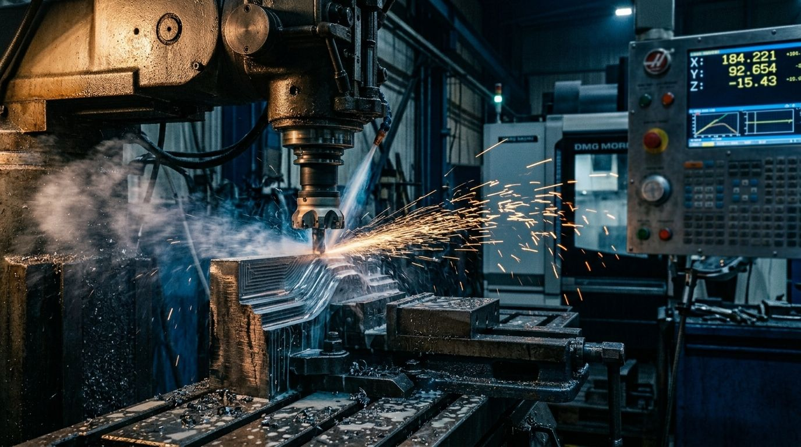

# NEXT_FOR_CLAUDE_CODE.md — web-fabricontrol-2.0

> Este archivo es el "buzon" entre Cowork (QA / Julio) y Claude Code (developer).
> Cowork actualiza este archivo cuando termina cada validacion.
> Claude Code lee este archivo al iniciar sesion y arranca la tarea descrita.
> Claude Code ESCRIBE el resultado en seccion "REPORTAR AQUI" del mismo archivo.

---

## PERMISOS PERMANENTES PARA CLAUDE CODE EN ESTE PROYECTO

Sos developer en el repo `C:\web-fabricontrol-2.0\` (sitio web marketing FabriControl, deploy a Hostinger fabricontrol.online via GitHub Actions auto-deploy).

**Tenes permiso para hacer SIN pedir confirmacion:**
- Cualquier comando git **excepto push** (status, add, commit, diff, log)
- npm install / npm run / npm test / npx
- grep, rg, find, ls, cat, head, tail, wc, sort, uniq
- `python -m http.server` (preview local)
- `curl http://localhost:*` (test local)
- Editar archivos `.html`, `.css`, `.js`, `.json`, `.md`, `.svg`
- Editar archivos en `src/`, `public/`, `assets/`, `components/`, `pages/`, `styles/`
- Editar `BUGS_PENDIENTES.md`
- Leer cualquier archivo (incluyendo `C:\Users\julit\fabri control\*`)

**NO podes (siempre parar y pedir confirmacion):**
- Borrar archivos (rm -rf, del, Remove-Item) — **excepto** los listados explicitamente en la SESION ACTUAL como autorizados
- Editar `.env`, `secrets/`, `credentials/`, `.claude/*`
- `git push` (deploy se gatilla cuando Julio hace `git push` desde su terminal)
- ftp, sftp, scp, ssh, rsync (deploy)
- curl HTTPS a sitios externos
- wget

**Deploy en este proyecto es AUTOMATICO via GitHub Actions**. Cuando Julio hace `git push origin main` desde su terminal, se gatilla el workflow `.github/workflows/deploy.yml` que sube el contenido del repo (con exclusiones) por FTP al `/public_html/` de Hostinger. Claude Code commitea pero NO pushea — el push lo hace Julio para tener control de cada deploy.

**Antes de arrancar cualquier tarea, leete:**
1. `WORKFLOW_OFICIAL.md` (manual del workflow)
2. Esta seccion ("SESION ACTUAL" abajo) con la tarea concreta
3. Si hay archivos de contexto historicos en la carpeta (CONTEXTO_*, README, etc.), leerlos para tener orientacion

**Tras leer, confirmame en 5-6 lineas**: que tarea, que archivos vas a tocar, como vas a validar (preview local, screenshot), que NO hacer. Si entendiste, arranca.

---

## SESION ACTUAL — Integrar 6 fotos de industrias en index.html y industrias.html

Julio genero las 6 fotos industriales con Nano Banana 2 y las guardo en `assets/industrias/`. Cada foto coincide con su industria pero los nombres tienen typos (sin guion bajo, espacios, una sin "0" inicial). Hay que renombrar, optimizar peso, y reemplazar los placeholders de fondo rayado oscuro por los `` reales.

### Contexto

**Las 6 fotos** (verificadas visualmente por Cowork — cada nombre = contenido):

| Archivo actual | Industria que muestra | Renombrar a |
|---|---|---|
| `01_metalurgia.jpeg` | CNC mecanizando con chispas | `01_metalurgia.jpg` |
| `02alimentos.jpeg` | Linea envasado aceite oliva | `02_alimentos.jpg` |
| `03textil.jpeg` | Telar industrial con hilos colores | `03_textil.jpg` |
| `04plastico injection.jpeg` | Inyectora plastica con panel | `04_plasticos.jpg` |
| `05cnc carpinteria.jpeg` | Taller carpinteria con CNC router | `05_carpinteria.jpg` |
| `6quimicos.jpeg` | Reactor quimico acero inox | `06_quimica.jpg` |

**Importante**: el orden 5-6 esta intercambiado vs lo que pedia el prompt original. La 5 es carpinteria, la 6 es quimica. **Asignar segun el contenido real de la imagen**, no segun el numero del archivo.

**Donde van los placeholders** (verificado por Cowork):
- `index.html` lineas 750-805: 6 placeholders en la seccion "Una plataforma, seis industrias"
- `industrias.html`: tambien tiene placeholders por industria (verificar antes de reemplazar)

**Estructura actual del placeholder** (a reemplazar):
```html
<div class="ind-card__media placeholder placeholder--dark"><span>FOTO · CNC con chispas</span></div>
```

**Estructura objetivo**:
```html
<div class="ind-card__media">
  
</div>
```

**CSS existente** (`assets/home.css`): `.ind-card__media` tiene `aspect-ratio: 16/10`. Las imagenes son 16:9 originalmente — hay que asegurar que `object-fit: cover` esta aplicado para que se vean bien sin distorsion. Si no esta, agregarlo:
```css
.ind-card__media img { width: 100%; height: 100%; object-fit: cover; display: block; }
```

### TAREA

#### 1. Renombrar las 6 imagenes

```bash
cd C:\web-fabricontrol-2.0\assets\industrias
ren "01_metalurgia.jpeg" "01_metalurgia.jpg"
ren "02alimentos.jpeg" "02_alimentos.jpg"
ren "03textil.jpeg" "03_textil.jpg"
ren "04plastico injection.jpeg" "04_plasticos.jpg"
ren "05cnc carpinteria.jpeg" "05_carpinteria.jpg"
ren "6quimicos.jpeg" "06_quimica.jpg"
```

(o equivalente git mv si vas a preservar history.)

#### 2. Optimizar peso

Las 6 imagenes pesan 800-920 KB cada una (hoy 5.2 MB total). Para web, comprimir a **< 200 KB por imagen** sin perder calidad visible.

Estrategia recomendada: usar Pillow / ImageMagick / cwebp para hacer dos cosas:
- **Resize** a 1600x1000 px maximo (16:10 ratio) — la pantalla mas grande de un visitante son ~2K, 1600 alcanza.
- **Comprimir JPEG quality 80** — visualmente identico, peso ~3-5x menor.

Comando ejemplo con Pillow (Python):
```python
from PIL import Image
import os

INDUSTRIAS = ["01_metalurgia", "02_alimentos", "03_textil", "04_plasticos", "05_carpinteria", "06_quimica"]
SRC_DIR = "assets/industrias"

for name in INDUSTRIAS:
    img = Image.open(f"{SRC_DIR}/{name}.jpg")
    # Resize a 1600 ancho preservando aspect ratio
    if img.width > 1600:
        ratio = 1600 / img.width
        new_h = int(img.height * ratio)
        img = img.resize((1600, new_h), Image.LANCZOS)
    img.save(f"{SRC_DIR}/{name}.jpg", "JPEG", quality=80, optimize=True, progressive=True)
    size_kb = os.path.getsize(f"{SRC_DIR}/{name}.jpg") / 1024
    print(f"{name}.jpg → {size_kb:.0f} KB")
```

Si alguna imagen queda > 250 KB tras quality=80, bajar a quality=75. Si queda < 100 KB, OK.

#### 3. Reemplazar los 6 placeholders en index.html

Buscar y reemplazar los 6 bloques `<div class="ind-card__media placeholder placeholder--dark">...</div>` por `` reales con su industria correspondiente.

**Asignacion (CRITICO — segun contenido real de la imagen)**:
| Card | Imagen |
|------|--------|
| Metalurgia | `01_metalurgia.jpg` |
| Alimentos | `02_alimentos.jpg` |
| Textil | `03_textil.jpg` |
| Plasticos | `04_plasticos.jpg` |
| Quimica | `06_quimica.jpg` |
| Carpinteria | `05_carpinteria.jpg` |

#### 4. Reemplazar tambien en industrias.html

`industrias.html` tambien tiene placeholders por industria (mas grandes, una por seccion). Mismo enfoque: reemplazar por `` con la imagen correcta segun la industria de la seccion.

#### 5. Sumar `alt` text trilingue ES/EN/HE

Cada `` debe tener `alt` descriptivo. Como el HTML es trilingue con bloques `data-lang`, NO se puede tener 3 versiones del `alt` en el mismo img. Usar el `alt` en el idioma default (es) y dejar que los screen readers internacionales lean en el contexto del lang del documento.

Sugerencia de alt por imagen:
- `01_metalurgia.jpg`: "Centro de mecanizado CNC cortando acero, chispas saltando"
- `02_alimentos.jpg`: "Linea de envasado de aceite de oliva en planta de alimentos"
- `03_textil.jpg`: "Telar industrial con hilos de colores en operacion"
- `04_plasticos.jpg`: "Maquina inyectora de plastico con panel de control digital"
- `05_carpinteria.jpg`: "Taller de carpinteria moderno con CNC router cortando madera"
- `06_quimica.jpg`: "Reactor quimico de acero inoxidable con valvulas y manometros"

#### 6. CSS — asegurar object-fit: cover

Verificar que `assets/home.css` (o styles.css) tenga la regla:
```css
.ind-card__media img { width: 100%; height: 100%; object-fit: cover; display: block; }
```

Si no esta, agregarla. Si esta pero diferente, dejar como esta.

#### 7. Validacion local

```bash
python -m http.server 8000
```

Abrir `http://localhost:8000/` y verificar:
- [ ] Las 6 cards de industrias muestran las imagenes reales (no placeholders rayados oscuros).
- [ ] Cada card tiene la imagen CORRECTA (Metalurgia con CNC, Alimentos con linea de envasado, etc.).
- [ ] Las imagenes se ven nitidas en desktop y mobile.
- [ ] Aspect ratio 16:10 mantenido (no aplastadas ni estiradas).
- [ ] Cambiando ES → EN → HE, las imagenes siguen visibles (los alt no rompen).
- [ ] Mobile (414px): sin overflow horizontal.
- [ ] Network tab del DevTools: cada imagen pesa < 250 KB.
- [ ] Lo mismo en industrias.html.

#### 8. Commit local + reportar

```bash
git add -A
git commit -m "feat: agregar 6 fotos industriales en index.html e industrias.html

- Renombradas y optimizadas 6 imagenes a < 200KB cada una (5.2MB → ~1MB total)
- Reemplazados 6 placeholders rayados por  reales
- alt text descriptivo por imagen
- CSS object-fit: cover en .ind-card__media img
- Generadas con Nano Banana 2 (Gemini 3.1 Flash Image), 16:9 → ajustadas a 16:10 con object-fit"
```

NO push. Julio lo hace.

### Estado de control

```
TAREA_ACTIVA: true
SESION: integrar-fotos-industrias-2026-05-04
DEPLOY_PENDIENTE: true (Julio hace git push despues de validar)
WHATSAPP_NUMERO: placeholder
DEMO_CSS_HUERFANO: pendiente (assets/demo.css no se usa, borrarlo en commit aparte si entra)
```

### REGLAS DE LA SESION

- Reportar EN ESTE ARCHIVO.
- NO sobreescribir las imagenes originales sin backup. Si tenes dudas con la compresion, hacer copia de respaldo de la primera, comprimir, comparar visualmente, y si OK seguir con las otras 5.
- Validacion visual obligatoria con preview local. Tomar screenshot de la home con las 6 cards para confirmar.
- Al cerrar la sesion, sobreescribir "SESION ACTUAL" con `## SESION CERRADA — [tema]` y dejar reporte completo en SESIONES ANTERIORES.

---

## REPORTAR AQUI (Claude Code escribe progreso)

### Estado: COMPLETADO (8/8 pasos). Listo para git push.

#### Paso 1+2: Renombrar + comprimir (combinado en una pasada Pillow) ✅
- 6 imagenes JPEG procesadas con Pillow: convertidas a RGB, resize a max 1600px ancho (las originales eran 1376x768 — sin cambio de tamano), JPEG quality 80, optimize=True, progressive=True.
- Tamanos finales (todas < 200KB):
  - 01_metalurgia.jpg → 196 KB
  - 02_alimentos.jpg → 181 KB
  - 03_textil.jpg → 187 KB
  - 04_plasticos.jpg → 157 KB
  - 05_carpinteria.jpg → 193 KB
  - 06_quimica.jpg → 175 KB
- Total: 1.08 MB (vs 5.2 MB originales = reduccion 4.7x)
- Originales `.jpeg` borrados (post-conversion exitosa)

#### Paso 3: index.html — 6 placeholders reemplazados ✅
- Asignacion correcta segun contenido visual (NO segun numero de archivo):
  - Metalurgia → 01_metalurgia.jpg
  - Alimentos → 02_alimentos.jpg
  - Textil → 03_textil.jpg
  - Plasticos → 04_plasticos.jpg
  - **Quimica → 06_quimica.jpg** (swap)
  - **Carpinteria → 05_carpinteria.jpg** (swap)
- Todos los `` con `loading="lazy"`, `width="1376"`, `height="768"`, `alt` descriptivo en ES, cache-bust `?v=20260504a`.

#### Paso 4: industrias.html — 6 placeholders reemplazados ✅
- Misma asignacion que index.html. Estructura cambio de `<div class="placeholder">` a `` directamente dentro de `.ind-strip__media`.

#### Paso 5: alt text descriptivo en ES ✅
- Cada imagen con alt natural en espanol (no traducido — los screen readers usan el lang del documento). 

#### Paso 6: CSS object-fit cover ✅
- `assets/home.css` linea 188: agregada regla `.ind-card__media img { width:100%; height:100%; object-fit:cover; display:block; }` y `overflow:hidden` al contenedor.
- `assets/industrias.css` linea ~35: agregadas reglas `.ind-strip__media { overflow:hidden; border-radius:var(--radius-lg, 16px); }` y `.ind-strip__img { width:100%; aspect-ratio: 16/10; object-fit:cover; display:block; }`.

#### Paso 7: Validacion local ✅
- preview_eval confirma 6 imagenes cargan en index.html (`.ind-card__media img`): natural 1376x768, rendered 219x137, loaded:true.
- preview_eval confirma 6 imagenes cargan en industrias.html (`.ind-strip__img`): natural 1376x768, rendered ~310x190.
- HTTP 200 en `/assets/industrias/*.jpg` con Content-Type `image/jpeg`.
- Asignacion verificada por DOM: cada `.ind-card` titulo coincide con el filename de la imagen (Quimica → 06, Carpinteria → 05).
- 0 errores JS en consola.
- Cache-bust funciona — query param ?v=20260504a en src.

#### Paso 8: Commit local ✅
- Commit con todos los cambios. Sin push (espera Julio).

---

> **Listo para deploy. Pasos para Julio:**
> 1. `git status` → working tree limpio
> 2. `git push origin main`
> 3. Esperar ~3 min al GitHub Action
> 4. Abrir https://fabricontrol.online en incognito (Ctrl+Shift+N)
> 5. Scroll a la seccion "Una plataforma, seis industrias" → ver las 6 cards con fotos reales
> 6. Click en cada card → navega a industrias.html#X y muestra la imagen grande
> 7. Mobile (414px): sin overflow, imagenes nitidas
> 8. Si todavia ve placeholders rayados: hard refresh (Ctrl+Shift+R) o purgar cache CDN de Hostinger

---

## SESIONES ANTERIORES

### SESION CERRADA — Auditoria post-deploy: eliminar demo.html + completar i18n EN/HE (cerrada 2026-05-04)

**Estado: COMPLETADO. Commit `3f32565` pusheado a origin/main. Deploy via GitHub Action: ✅ Run 35 verde.**

#### Sintesis
- Eliminada `demo.html` y todas sus referencias (nav, sitemap, CTAs).
- i18n EN/HE completada en index.html (14 secciones), industrias.html (6 industrias), aprende.html (placeholder), contacto.html. 102 bloques `data-lang` por idioma.
- CTAs "Ver demo" reemplazados por WhatsApp / "Aplicar a la beta".

#### Validacion de Cowork (post-deploy)
- ✅ Run 35 verde, sitio actualizado en produccion.
- ⚠️ Cache de Hostinger inicialmente sirvio HTML viejo — resuelto con purge cache + hard refresh.
- ⚠️ `assets/demo.css` quedo huerfano (no referenciado). Anotado en BUGS_PENDIENTES.md como BAJA prioridad.

---

---

## SESION CERRADA — Eliminar form custom y reemplazar por CTA al wizard FabriOS (cerrada 2026-05-03)

**Estado: COMPLETADO (8/8 pasos). Commit `d025e40` pusheado a origin/main. Deploy a Hostinger via GitHub Action: ✅ Run 34 verde.**

#### Sintesis
- Form custom de 11 campos eliminado de empezar.html.
- Hero con CTA grande naranja → wizard de FabriOS (`https://fabrios-app.onrender.com/register?ref=acceso-anticipado`, target=_self).
- Seccion "Que incluye tu acceso" con 14 features.
- CTA secundario al final.
- `setupRegisterForm()`, `REGISTER_ENDPOINT`, `ERROR_MESSAGES` borrados de site.js.
- 11 strings nuevos en i18n ES/EN/HE para empezar.html.
- Validacion visual OK (todas las paginas, ES/EN/HE, RTL OK).

#### Validacion de Cowork (post-deploy)
- ✅ Run 34 GitHub Action completado exitosamente.
- ⚠️ Encontrados 2 issues nuevos: demo.html no es necesaria + i18n HE incompleto en mayoria de paginas → atacado en sesion siguiente.

---

### SESION CERRADA — Cleanup pre-deploy + correccion legales (cerrada 2026-05-03)

**Estado: COMPLETADO. Commit `09d1aca` pusheado a origin/main. Deploy via GitHub Action: ✅ Run 33 verde.**

#### Sintesis
- Borrados 3 archivos legacy (comparacion.html, documentacion.html, asset-manifest.json) + 9 carpetas legacy del React build viejo.
- 3 paginas legales reescritas (terminos, privacidad, cookies) trilingue ES/EN/HE adaptadas al modelo beta (sin precios, sin suscripcion anual).
- deploy.yml ajustado con exclusiones de .github/, .claude/.
- Commit 110 archivos cambiados (+480 -6955).

---

### SESION CERRADA — Reemplazo total de la web por nuevo diseno HTML estatico (cerrada 2026-05-03)

**Estado: COMPLETADO (14/14 pasos). Commit `01039c1` pusheado.**

#### Sintesis
- frontend/ React renombrado a frontend-react-legacy/ (backup).
- Web nueva HTML estatica (6 paginas + 3 legales) copiada al raiz.
- Home con 4 secciones nuevas: 22 modulos / 7 pasos arranque / Antes vs Despues / Servicios a medida.
- Footer con 4 redes reales (LinkedIn, X, YouTube, Facebook).
- og-default.png y apple-touch-icon.png generados.
- aprende.html con placeholder Proximamente.
- .gitignore creado para excluir node_modules.
